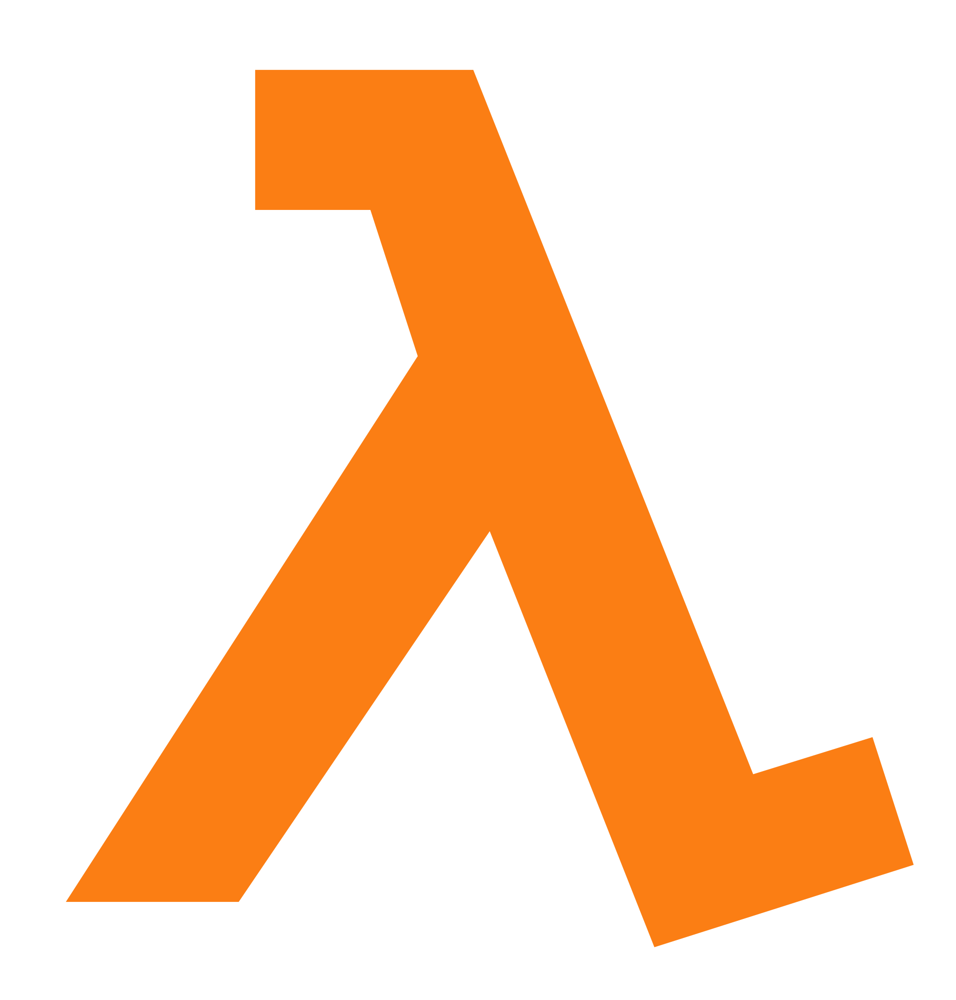

# Haskell dedicated repository

This repository was created for one purpose - try to understand functional (λ) programming — it's paradigm.

Haskell good for those, who try to understand the basis of functional programming, powerful features which not many languages have.

# [Haskell](https://www.haskell.org/)

## Purely functional
> Every function in Haskell is a function in the mathematical sense (i.e., "pure"). Even side-effecting IO operations are but a description of what to do, produced by pure code. There are no statements or instructions, only expressions which cannot mutate variables (local or global) nor access state like time or random numbers.
## Lazy
> Functions don't evaluate their arguments. This means that programs can compose together very well, with the ability to write control constructs (such as if/else) just by writing normal functions. The purity of Haskell code makes it easy to fuse chains of functions together, allowing for performance benefits.

## [Haskell Docs](https://hoogle.haskell.org/) for commands search

